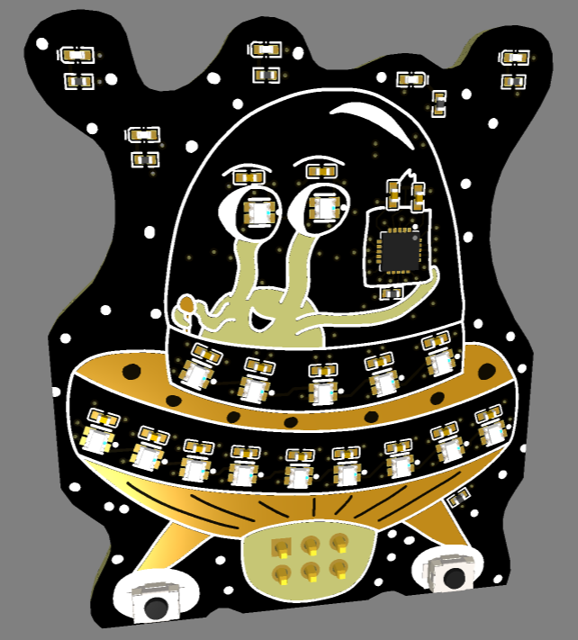
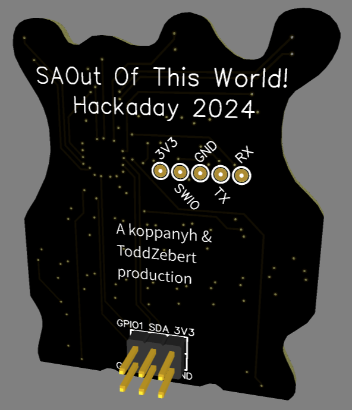

# SAOut Of This World

Originally intended for the [2024 Supercon SAO Contest] (https://hackaday.com/tag/2024-supercon-sao-contest/) but we missed the deadline. Wha wha. We'll be introducing it at Supercon 2024 in early November in Pasadena, CA.

A koppanyh and Todd Zebert production. 
 
Copyright (c) 2024 koppanyh & Todd Zebert, under a modified MIT license.

Kop handled the PCB design and art, with a bit of input from Todd, while Todd was working on the code bouncing ideas off of Kop.

Besides being out of this world in design and fairly LED-y, it works as an i2c target device to both select different "effects" or assume complete control of the 5 LEDs and 16 WS2812s. Two LEDs are wired to in a special "sensing" circuit. It also features two buttons.

The left button sequences between "Effects" for the Upper Trim (the 5 WS2812's in the middle), while the right button sequences between Effects for the Lower Trim (WS2812's at the bottom).

Todo's
" Create hackaday.io project 
" see firmware readme

